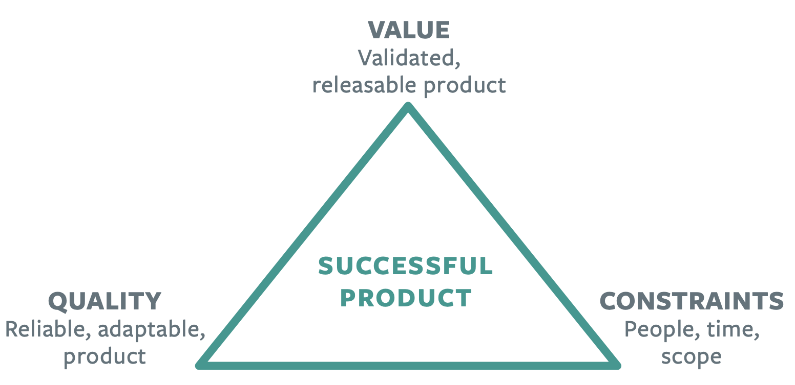

# Balance Value vs. Quality vs. Constraints

Agile teams make tradeoffs between value, quality and constraints to successfully respond to change.

## Making Tradeoffs Against the Right Goals

Project management and product management are two commonly applied mindsets when it comes to defining software success.

Product management is responsible for defining what the product is and for whom, and how the product will drive business impact. Success is to deliver the right value at the right time.

## Value, Quality, Constraints

Product initiatives have three goals:

1. Create customer value that drives business impact
2. Build in and maintain quality to enable the team to develop at speed forever
3. Deliver within given constraints: people, time and scope

## What is Value and Why Does it Matter?

Value is the benefits delivered to customers through the features we build and the business impact created when customers engage with the product. Value is measured by what our customers want or desire, and by the goals we need to meet to have a successful business.

To deliver value, we need to do the simplest thing that delights the customer, that is margin-enhancing and that helps differentiate us in the market. This requires us to know what features to build, what features to not build, and to ship new and improved features continuously.

## What is Quality and Why Does it Matter?

Quality is defined as reliability and adaptability. Reliability means that our customers have a consistently good experience using the product. Adaptability means that we are able to keep evolve the product at a predictable pace so that it continues to deliver future value. To keep quality high and maintain a steady foundation we need to keep our design and tech debt low.

## How Should We Think About Constraints?

Constraints are important but they are not the actual goals of the product. They work as guardrails for the team, establishing clear expectations about delivery. Only one of the three constraints can be fixed. In agile organizations, it’s usually time.