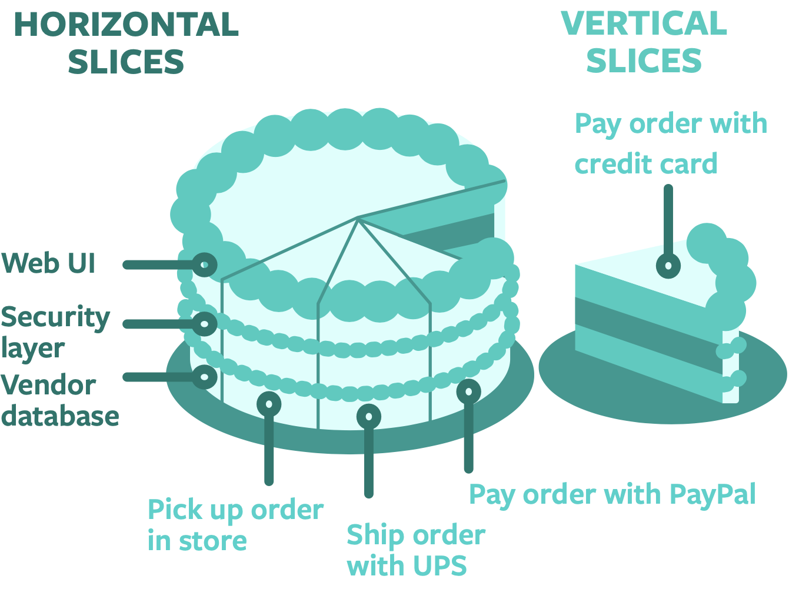

# Manage the Backlog
The backlog is where we translate our product vision and strategy into the day to day tactical work of product development.

## What is a Product Backlog?
The backlog is a list of development work derived from the product roadmap, organized by priority. The most important piece of work is at the top. A well organized and up-to-date backlog enables the team to build features and functionality efficiently, with a predictable rate of output.

**Product Managers own the backlog**. They gather input from all perspectives on the team to inform priority.

## Breaking Down the Product
Many teams build products horizontally, breaking the work down along architectural boundaries. For instance, separate teams might build the backend vs the front end layers. The problem with this approach is that we can’t ship anything usable to our users until we’ve finished and connected all the layers.

Agile teams  work in vertical slices, which means that we build the product one small feature at a time. This allows us to frequently deliver new value to users, and get their feedback on the new functionality. Frequent user feedback helps us make necessary adjustments sooner and at smaller scale than with big releases.

### Example

One vertical unit of development work may encompass GUI, client and backend work – whatever is needed to deliver one unit of value to the user.

These thin vertical slices are commonly referred to as stories. Product Managers work closely with the team to split development work into good stories.

## The Smaller Slices, the Better

The smaller we can make a story, the simpler it will be to understand, estimate, implement and test. We can more easily predict when features will be ready to ship. 

Small stories enable frequent tangible progress which feels great for the team, the stakeholders and the product sponsors, and means that value is delivered quickly to users and the business.

## Continuous Prioritization Enables Agility

Agile teams practice continuous prioritization. We look a few weeks’ ahead to plan our work at a high level, but we don't commit to a fixed sprint scope. This is because we may - at any time - learn about unexpected changes or new information that may make us reevaluate our priorities. Continuous prioritization enables us to maximize our responsiveness to changing conditions and navigate complexity and uncertainty better than if we were to stick to a detailed upfront plan.

Developers always pick up and work on the story at the very top of the backlog, so the order of the stories is very important. A story’s position in the backlog reveals its priority - the most important stories are at the top of the backlog, while the less important stories are near the bottom. The Product Manager ensures the order of the backlog represents the latest priority.
