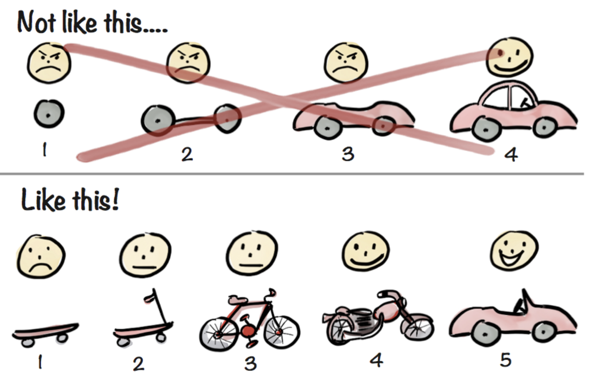
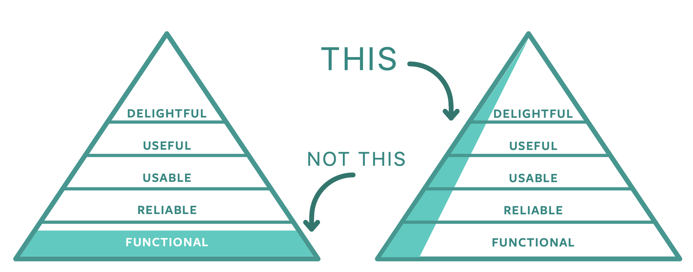

# Minimum Viable Product (MVP)

The Minimum Viable Product is THE SMALLEST POSSIBLE VERSION OF OUR PRODUCT that delivers on the product’s value proposition. If it fails, our losses are small. If it succeeds, we’ll make it bigger and test it again

## The MVP is a Learning Milestone

*The most expensive way to test your idea is to build production quality software – Jeff* *Patton*

The purpose of the MVP is to help us learn whether we should continue to build the product or not. An MVP is not a delivery milestone, it’s a learning milestone.

The MVP is an experiment designed to test our product’s value proposition. It’s the smallest possible version of our product that enables us to learn the most about our customers with the least amount of effort. Do early adopters of our product find it so valuable that they’d be upset if they no longer were able to use it? Have we found a repeatable way of selling our MVP? The MVP helps us answer these questions faster.

## An MVP is not...

- The first version of the product that we feel comfortable showing our executive sponsors or releasing to market
- A proof of concept
-  A minimum set of features without an accompanying set of business goals and KPIs
-  A complete product for internal demonstration purposes
-  Always software

The Minimum Viable Product is **few features done well**. We iterate on the product not by building it one layer at a time, but by building a small pyramid first and then making the pyramid bigger and bigger.

