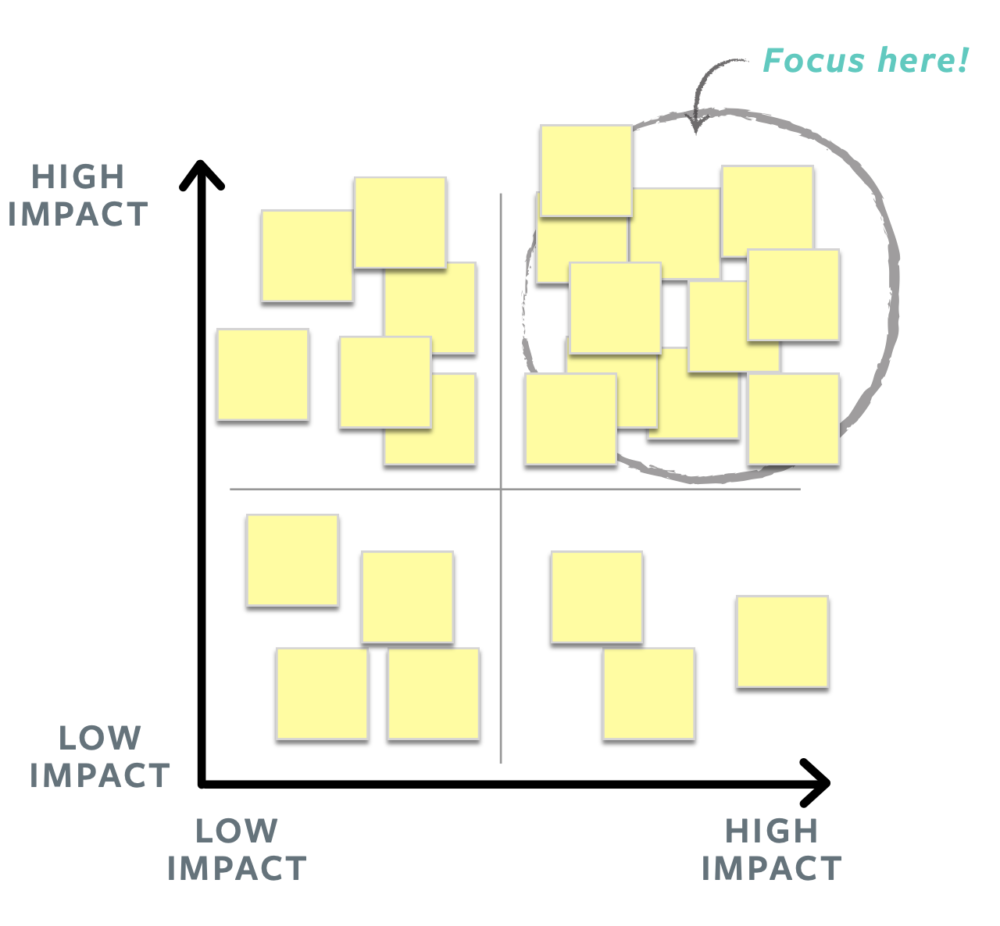
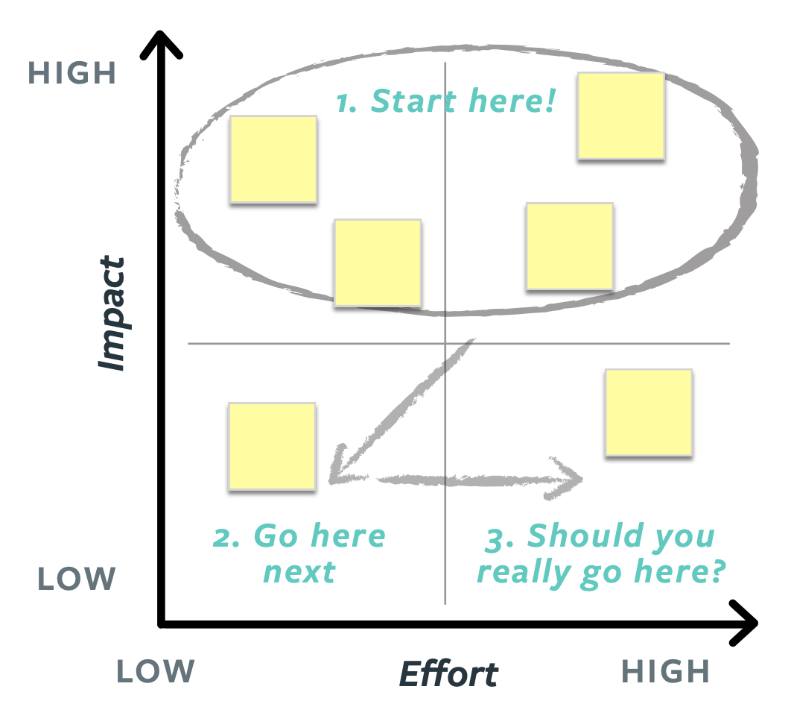

# Prioritize Features
One of the most important responsibilities of a Product Manager is to prioritize features: decide what to build (or not), and when to build it.

## Say No a Thousand Times

*People think focus means saying yes to the thing you've got to focus on. But that's not what it means at all. It means saying no to the hundred other good ideas that there are. You have to pick carefully. I'm actually as proud of the things we haven't done as the things I have done. Innovation is saying no to 1,000 things.– Steve Jobs*

Feature ideas can come from many places:

- Anyone on the product team
- Product sponsors and stakeholders 
- Founders and Board of advisors
- Customers
- Competitors

Product Managers filter these ideas. It's not possible to do everything, and it's even less possible to do everything at the same time. We need to make sure that the team is only working on features that should be built, and always working on the next highest-value feature. This means we must learn when (and how) to say “no”, and when to say “yes”. Unless we know when to say no, we will end up with a lot of tangentially related features, a complex product that no one is really happy with and an overworked product team.

## Is It Valuable? Can We Do It?
There are several heuristics we can apply to make informed prioritization decisions. We need to consider **viability** (will it help our business?), **desirability** (do our users want it?), and feasibility (**can** we do it?).

Feature prioritization is part science and part art. Develop an instinct for what your users want, and then use data and a robust process to back it up.

At a minimum, the features we decide to build should:

- Satisfy a user need or desire...
- ...be shared by most users
- Help us make progress against a business goal 
- Be possible for the team to build well and ship fast

## Process

### Brainstorm Solution Ideas

### Organize the ideas based on impact against top user needs

### Take ideas which have  high impact on user needs and organize them based on impact against business goals

### Take ideas that have high impact against business goals and organize them based on effort

Start by building features above the horizontal line. These are features that help us address  top user needs and top business goals.

