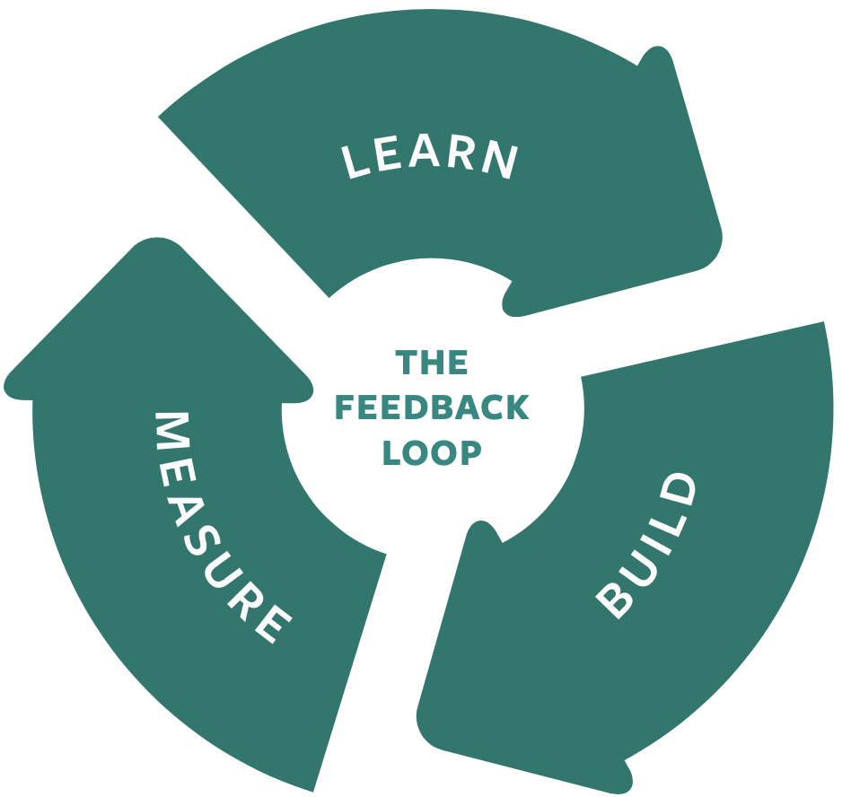
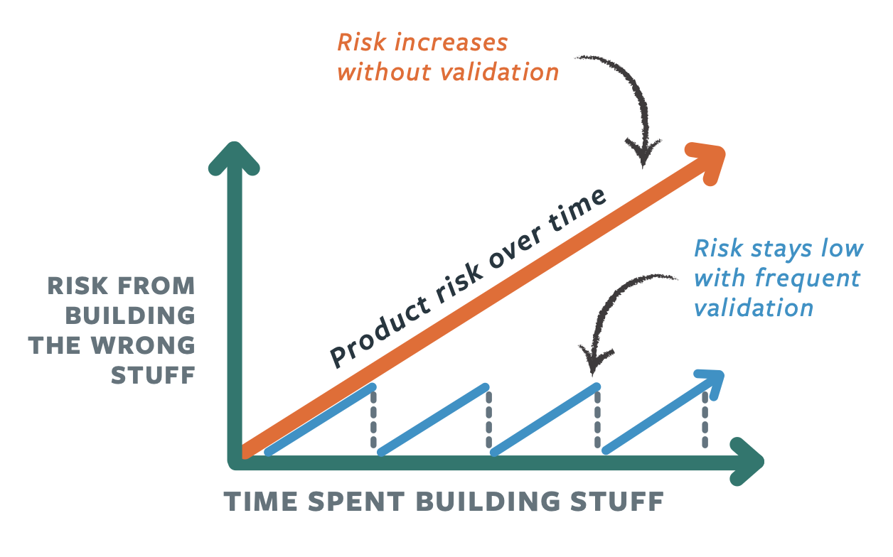

# Product Development Phases

We use a "Build-Measure-Learn” feedback cycle to continuously turn uncertainties and assumptions into facts. Starting with ideas, we identify our riskiest Assumptions, build simple tests, run those tests, analyze the test data and then use what we learn to inform our next steps. 

We don't treat product definition, design, development, and testing as separate phases. Instead, we do all of these activities in parallel via short and frequent cycles throughout the product life cycle.

## Learn

- Validate/invalidate riskiest Assumptions about personas
- Top problems to solve
- Research Existing Solutions 
- Desirability of solution
- Feasibility of solution
- Viability of product 
- Business model sustainability 
- Business model optimizations

## Build

- Interview scripts
- Value proposition
- Prototypes
- Minimum Viable Product
- Usabiliy tests

## Measure
  - Customer observation and interviews
  - Split tests
  - Real-time monitoring
  - Funnel analysis
  - Cohort analysis
  - Search engine marketing

## Measuring Progress
We look at two things to determine if we are making progress:

  - Validated learning, which de-risks our product and business
  - Working software, which delivers value to our customers, and thus to our business