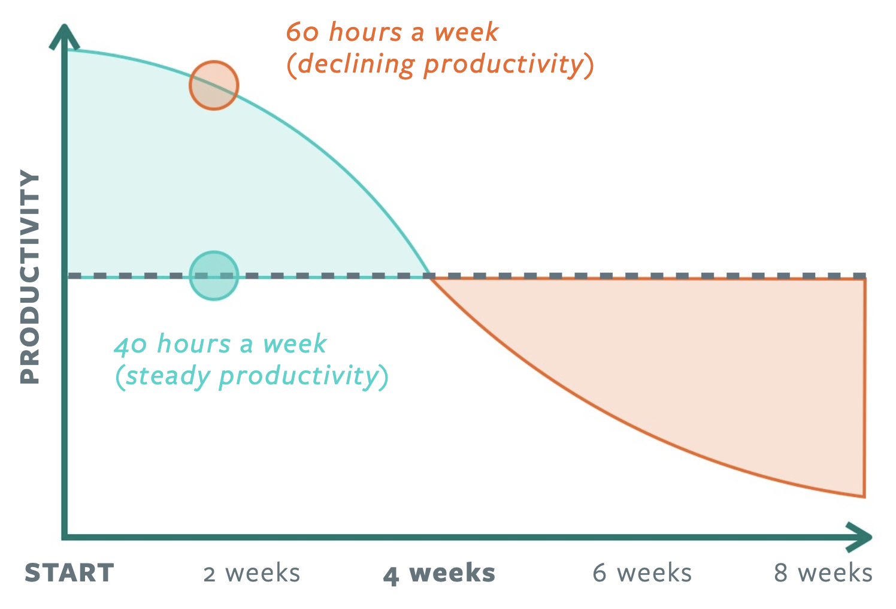

# Sustainable Pace

To deliver value fast, & forever, we need to make sure we’re running at a comfortable marathon pace rather than rushing through a series of high-intensity sprints.

## Let’s go Fast, Forever

Sustainable pace is a core tenet of agile. It states that the team should aim to establish a work pace that they can sustain indefinitely. This enables us to build better products, ship it in a predictable manner and do so with regularity.

You'll notice that much in our environment reflects our belief in sustainable pace:

- The entire office is present for office-wide standup shortly after 9 am
- Morning breakfasts fuel people for the day ahead, and regular breaks clear our heads between bursts of high-focus activities.
- We jointly take lunch for an hour at 12:30 pm
- We leave work at 6:00 pm sharp. 

## More Hours, More Problems

We believe that building a product is a marathon, not a sprint. We don’t do "crunch time". We believe that putting in significant overtime is detrimental to work quality, team productivity and team health.

Willpower is a depleting resource. If we don’t replenish it by sleep, our discipline and work suffer. In the long run, long hours lead to burnout and poor decision making. A developer who stays up late to code a feature may realize the next morning that they’ll need to rewrite it all. Even if the work is good, working late without the rest of the team reduces shared ownership of the project by creating knowledge silos where one developer makes decisions without consulting the team. Working 8 hours a day at full intensity and then leaving work concerns at work produces better results than working extra hours on a regular basis.

We believe that teams get more done by identifying and minimizing any non-productive activities during the work day, allowing the team to focus on value-generating activities for the majority of the day. Hours spent don't matter so much if we focus on maximizing the value we produce. 

Product Managers play a critical role in sustainable pace by prioritizing the right product and business goals, and communicating with the right stakeholders to ensure that whatever is delivered isn’t a surprise. This means regular demos, stakeholder check-ins, maintaining an up-to-date product roadmap, and creating consensus with the business to avoid scope creep and ‘crunch time’. Product Managers take initiative on efficiency-improving activities such as removing team blockers, eliminating unproductive meetings, and boosting team morale. Think outside the box for how you can contribute to sustainable pace and team happiness – no team ever complains when their Product Manager surprises them with donuts!

