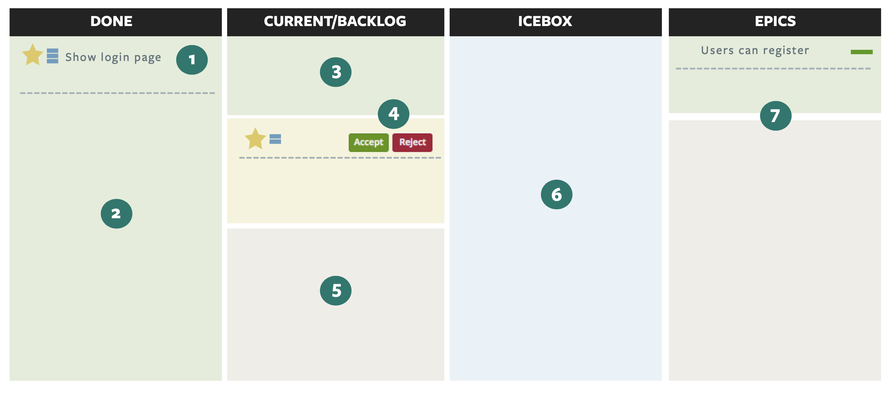
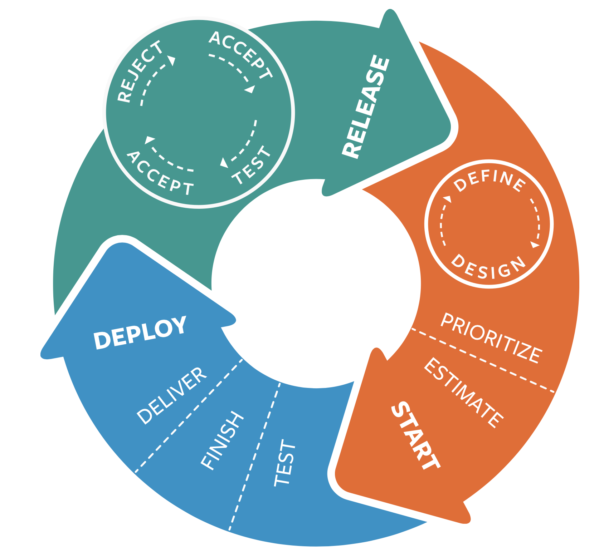

# Task Management
We manage the backlog using task management tools. 

  - Simple, story-based agile project planning tool that allows teams to collaborate and react instantly to real-world changes. 
  - Central repository and historical record of what will be done and a way to look back on development history.

### (1) USER STORY

A story is something that a user wants, like “See activity feed” or “Filter product catalogue”. Stories can be grouped together by labels.

### (2) DONE

These stories have been implemented by the development team and accepted by the Product Manager.

### (3) CURRENT

Stories that have been picked up by developers and are in various states of implementation. The story status is updated as the story is picked up and delivered. 

### (4) ACCEPTANCE & REJECTION

When the functionality matches the acceptance criteria outlined in the story, we accept it. If the functionality does not meet the acceptance criteria, we reject the story and add a comment explaining what is incorrect or missing.

### (5) BACKLOG

The backlog contains stories that are ready to be estimated or worked on. The story in the top is the next story that will be implemented. Stories are prioritized based on what will add the most user value.

### (6) ICEBOX

Stories that need more thought and detail. The content of the icebox does not need to be prioritized.

### (7) EPICS

Larger user stories and themes that are too big to be described in a single user story. 

Examples:  “User can register” or “Administrator should see user analytics”

## Useful Tools

- Asana
- Linear
- Spreadsheets

##  Task Workflow

Agile development consists of a continuous feedback loop. Each story has a workflow from conception to release.

Agility comes from frequent feedback. Story acceptance, rejection, and release gives you the opportunity to give feedback to and get feedback from your customers, your team, and your stakeholders.

### (1) PRIORITIZATION
 The Product Manager prioritizes stories in the backlog.

### (2) ESTIMATION
 The team discusses and collectively estimates each
 story.

### (3) STORY START
 Developers pick up and begin work on the next available story.

### (4) STORY IS FINISHED

The developers commit all code changes to the project repository, and finish the story.

### (5) STORY DELIVERY

The committed code changes go through Continuous Integration testing. When tests pass, the new feature is deployed to the team's acceptance environment, and the story is delivered.

### (6) ACCEPTANCE
 The Product Manager reviews delivered stories against their acceptance criteria. If a story is complete, the Product Manager accepts it. If a story is incomplete the Product Manager rejects it.

### (7) PRODUCTION RELEASE

The code for the accepted stories is pushed to the team’s production environment, where users can interact with the new features.

### (8) ... AND REPEAT.

Based on user feedback, input from the business and what we learned from our previous product release, the Product Manager determines what to prioritize next.