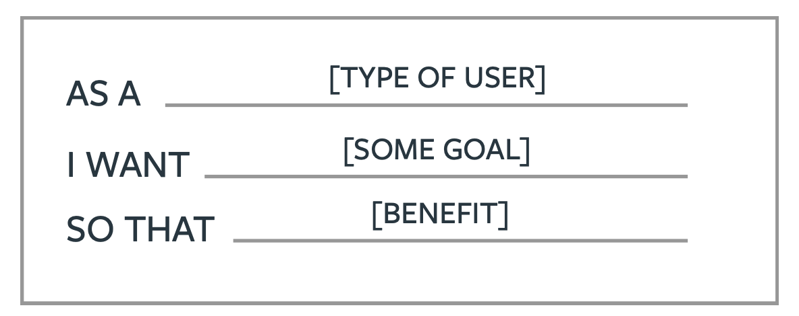
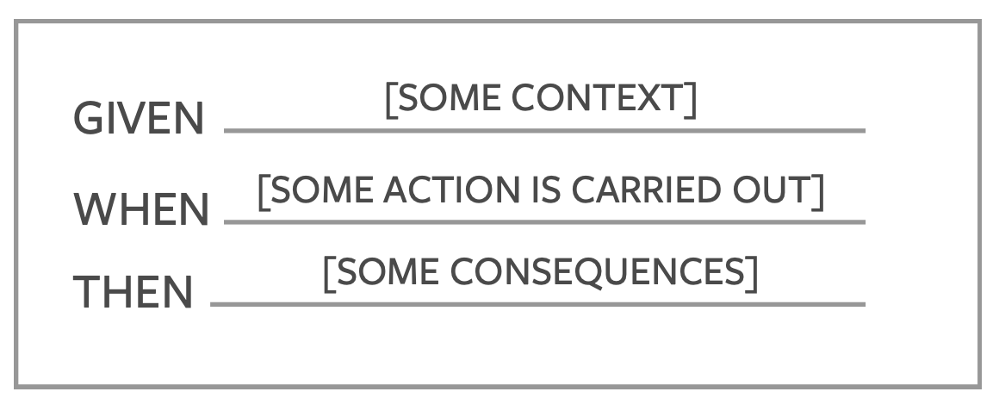
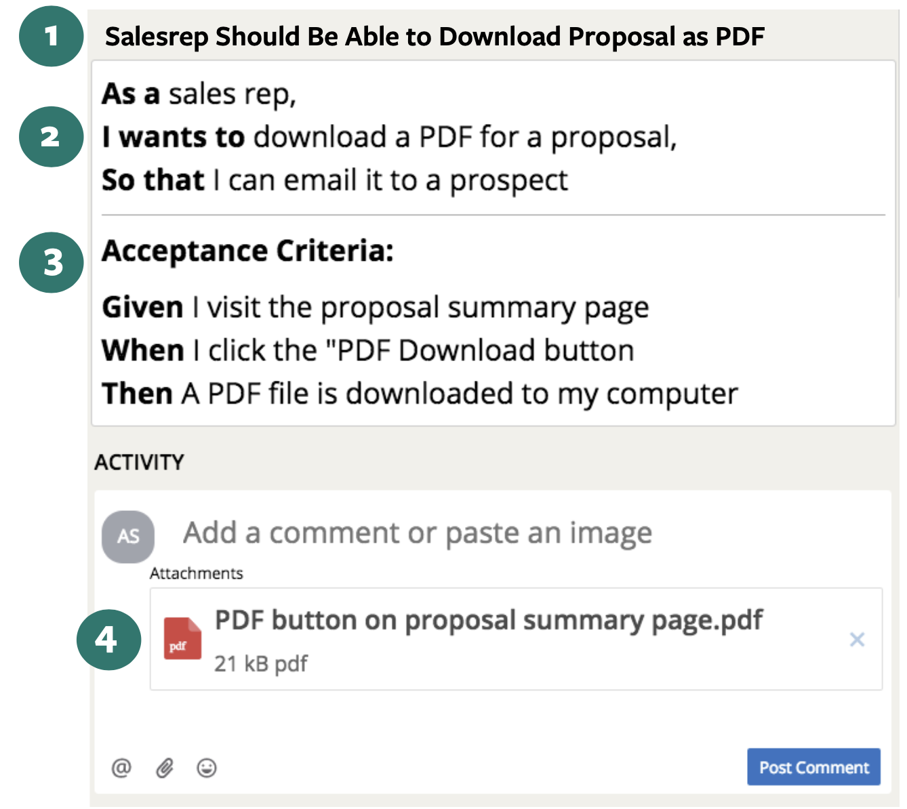
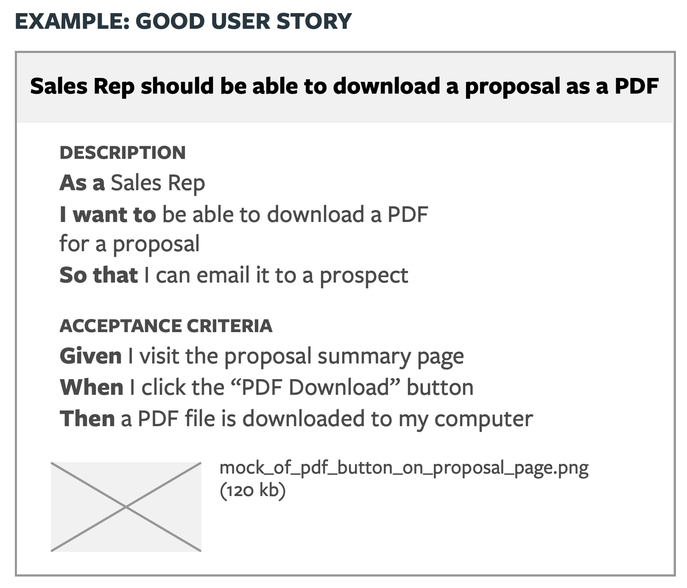
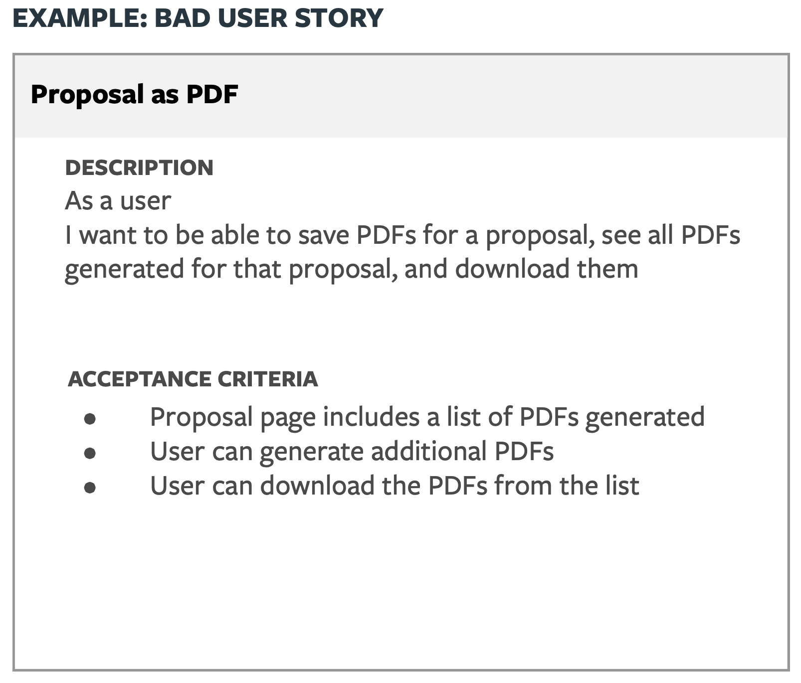

# User Stories

A user story is a short, simple description of a feature told from the perspective of the person who desires the new capability, usually a user or customer of the system.

## Why Do We Care About User Stories?

User stories are designed to explain the who, what and why of the smallest incremental feature that can be added to a product. They are written from the user’s perspective, explain incremental business or user value, and act as light weight requirements documentation for a development team. A story is a placeholder for a conversation. After a story is completed, it becomes a view into our conversation history and the decisions we’ve made.

## Who Writes stories?

While anyone on the team can contribute stories, it is the Product Manager’s responsibility to maintain a healthy backlog. The Product Manager does this by writing and prioritizing enough user stories for two weeks of development work.

## How?

### Title

The title should be short and descriptive

### Description

The description should explain who wants the functionality, why and to what end. This typically follows the form:

### Acceptance Criteria
The acceptance criteria are a list of scenarios the Product Manager will use to test that the story has been completed and is also used as a starting point for the developer's tests. This typically follows the form:

### Resources

Mocks, wireframes, user flows and other assets that help explain the user story

Read about the INVEST mnemonic to better understand the What and Why of writing backlog stories.	

## Examples

### What Makes This a Good User Story?

- The title is clear and descriptive
- The user is clearly identified
- The story has a clear beginning and end
- The acceptance criteria satisfy the user’s goals
- There are resources attached that describe all the non-obvious details that are important to the user and the business
- The user story represents the smallest amount of verifiable functionality that provides incremental value

### What Makes This a Bad User Story?

- The title is clear and descriptive
- The user is clearly identified
- The story has a clear beginning and end
- The acceptance criteria satisfy the user’s goals
- There are resources attached that describe all the non-obvious details that are important to the user and the business
- The user story represents the smallest amount of verifiable functionality that provides incremental value

## Other Story Types

Chores, bugs, and release markers represent work that needs to get done but doesn’t provide direct value to the user or the business.

### Chores, Bugs and Release Markers Are Stories, Too

Just like the user story, these story types represent concrete tasks or deliverables. However, because they do not provide direct business or user value, they do not get estimated. 

### Release Marker

Releases are milestone markers and allow the team to track progress towards concrete goals. For example stakeholder or investor demos, software launches, etc. It's possible to specify target dates for releases. The Product Manager decides how to organize the backlog into releases.

### Chore

A chore is a story that is necessary but provides no direct, obvious value to the user.

Chore examples:

- "Setup new domain and wildcard SSL certificate for test environments"
- "Evaluate tools for system troubleshooting Exploratory testing." (This is often referred to as a “Charter")

Chores can represent “technical debt” and points of dependency on other teams. Chores are not estimated, as they do not contribute business value directly. Developers, often in partnership with the Product Manager, create chores for the backlog.

### Bug

A bug is a defect in a feature that has already been accepted, regardless of when it was accepted. Do not use bugs to detail new features and functionality.

Bug examples:

- "Price should be non-negative" 
- "Login button doesn’t work"

Bugs do not have points because they are directly related to features that have already been delivered. A bug description should include steps to recreate the bug such that anyone, with minimum context, can see the bug themselves.

Anyone on the team can create a bug. It’s up to the Product Manager to prioritize it.

## Know Your Story Markers

⭐️ USER STORY. The ‘who’, ‘what’, and ‘why’ of a new feature.

❖ STORY POINTS. The estimated relative complexity of a story.

⚙️ CHORE. Tasks that are necessary but don’t add direct or obvious user value.

♦️ BUG. Tasks that will resolve unintended behavior. 

🏁RELEASE. Project milestone.
