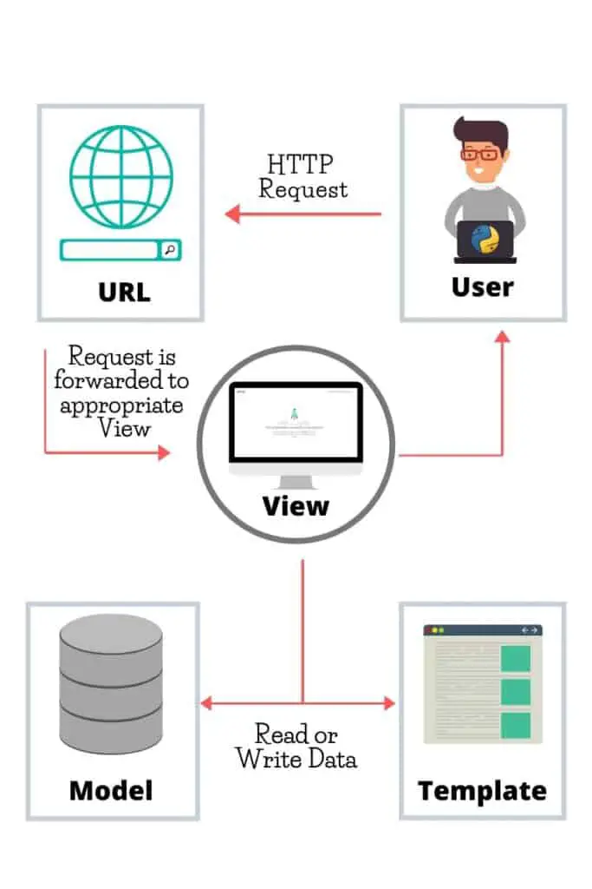

# Django Knowledge (Draft)
## Python-based Web application framework
Updated: 2024-01-16 / JRO

## Why Django?

## Official Documentation & Reference
- [Django Project website](https://www.djangoproject.com/)
- [Django Documentation](https://docs.djangoproject.com)
- [Django documentation - Table of Contents](https://docs.djangoproject.com/en/5.0/contents/)
- [Django Module index](https://docs.djangoproject.com/en/5.0/py-modindex/)
- [Django Source code](https://github.com/django/django)

## Django Demo
- [DjangoSites](https://www.djangosites.org/)

## Django Community
- [Django Project community home](https://www.djangoproject.com/community/)
- [Django Forum](https://forum.djangoproject.com/top?period=monthly) (top-monthly topics)
- [Django forum on Reddit](https://www.reddit.com/r/django/top/?t=month) / Top in last month
- [Django Girls](https://djangogirls.org/en/)
- [Local Django Community](https://www.djangoproject.com/community/local/)
- - Django Forum / [Top "Getting Started topics" this month](https://forum.djangoproject.com/c/users/getting-started/16/l/top)

## Django News
- [Official Django blog](https://www.djangoproject.com/weblog/)
  - [RSS feed](https://www.djangoproject.com/rss/weblog/)
- [Django Release Notes](https://docs.djangoproject.com/en/5.0/releases/#development-release-notes)

## Django Events
- Django Forum / [Topics about Django Events](https://forum.djangoproject.com/c/events/12)
- [Django Girls events](https://djangogirls.org/en/events/)
    - [Contribute to Django Girls](https://djangogirls.org/en/contribute/)
- [Organizing Django Events & Workshops](https://organize.djangogirls.org/)

## Testing Django
- [Django Testing Tools](https://docs.djangoproject.com/en/5.0/topics/testing/tools/#)

## Deploying Django
- [Django Deployment Checklist](https://docs.djangoproject.com/en/5.0/howto/deployment/checklist/)
- https://developer.mozilla.org/en-US/docs/Learn/Server-side/Django/Deployment
  

### Platforms
- Railway
- AWS EC2 and RDS
- https://appliku.com/

## Style guide
https://github.com/HackSoftware/Django-Styleguide

https://github.com/cookiecutter/cookiecutter-django
https://github.com/agconti/cookiecutter-django-rest
https://cookiecutter-django.readthedocs.io/en/latest/

https://www.django-antipatterns.com/

Class based views - https://ccbv.co.uk/

## Continuous Integration / Deployment
- Automated Testing
- Deployment

## Developer Tools
### Code Editor
- Visual Studio Code
- Django Debug Toolbar

https://cookiecutter-django.readthedocs.io/en/latest/developing-locally.html#setting-up-development-environment

## Getting Help & Support
### Frequently Asked Questions (FAQs)
- [Django Project FAQ](https://docs.djangoproject.com/en/5.0/faq/)
- [Stack Overflow](https://stackoverflow.com/questions/tagged/django)

### Troubleshooting Django
- Profiling a Django Application
- Debugging a Django Application

## Python Package Manager (Pip)
- https://pip.pypa.io
- https://docs.djangoproject.com/en/5.0/topics/install/#installing-an-official-release-with-pip

## Virtual Python Environment (Venv)
- https://docs.python.org/3/tutorial/venv.html
- How to create a virtual environment
  - https://docs.djangoproject.com/en/5.0/intro/contributing/

## Templates / Boot-up
django cookiecutter project

### Application Containers (Docker)
- How to Dockerize a Django Application

### Hosting Django Applications
- Research: AWS, Render, DigitalOcean, Hetzner

### Security
- [Django security](https://docs.djangoproject.com/en/5.0/topics/security/)
- HTTPS

### Monitoring Tools
- Research: Sentry, New Relic

### Scaling
#### Caching
#### Task Queues
#### Optimizing Database

### Internationalization

### Databases
#### SQLite
- https://www.sqlite.org/index.html
- [Django SQLite notes](https://docs.djangoproject.com/en/5.0/ref/databases/#sqlite-notes)

#### Postgresql
- https://www.postgresql.org/
  - https://www.postgresql.org/docs/
- [Django PostgreSQL notes](https://docs.djangoproject.com/en/5.0/ref/databases/#postgresql-notes)

### Templates

### Styles (CSS)

### Models

## Views

### Forms
- Formsets
- Model forms

### Management

### Search
- Django Search

### Templates
- Django Template language  

### URL Routing

### User Authentication with Django

### User Groups and Permissions with Django

### Building an API with Django
- Django REST Framework
- API documentation
- Securing API endpoints

### Payment Processing with Django
- Stripe

## Django Advice
- Having just ONE urls.py
- Explicit is better than implicit. (thin views and fat models/views-services-models ; it doesn't matter as long as it is explicit)
- Errors should never pass silently. (Never write try/except:pass, and use django-debug-toolbar and Sentry)
- If you want to deploy to production and care about downtimes and continuous delivery then Docker is the way to go. 
- VPS. Nginx, gunicorn

## Videos
"Dennis Ivy on Youtube is one best best django instructor out there."

## Books
William S. Vincent- Django for beginners 
Two scoops django 

## Resources

### Python Libraries
- [Python Package Index (PyPI)](https://pypi.org/)
  - [Browse by Topic](https://pypi.org/search/) - (Click expander)

## Contribute to Django
- [Contribute to Django](https://docs.djangoproject.com/en/dev/internals/contributing/)
- https://www.djangoproject.com/fundraising/
- https://github.com/sponsors/django
- https://www.patreon.com/djangogirls

https://cookiecutter-django.readthedocs.io/en/latest/project-generation-options.html

https://cookiecutter-django.readthedocs.io/en/latest/developing-locally-docker.html

https://docs.docker.com/compose/

https://django-ninja.dev/

## Python
- [Python for Non-Programmers](https://wiki.python.org/moin/BeginnersGuide/NonProgrammers)
- https://diveinto.org/python3/table-of-contents.html