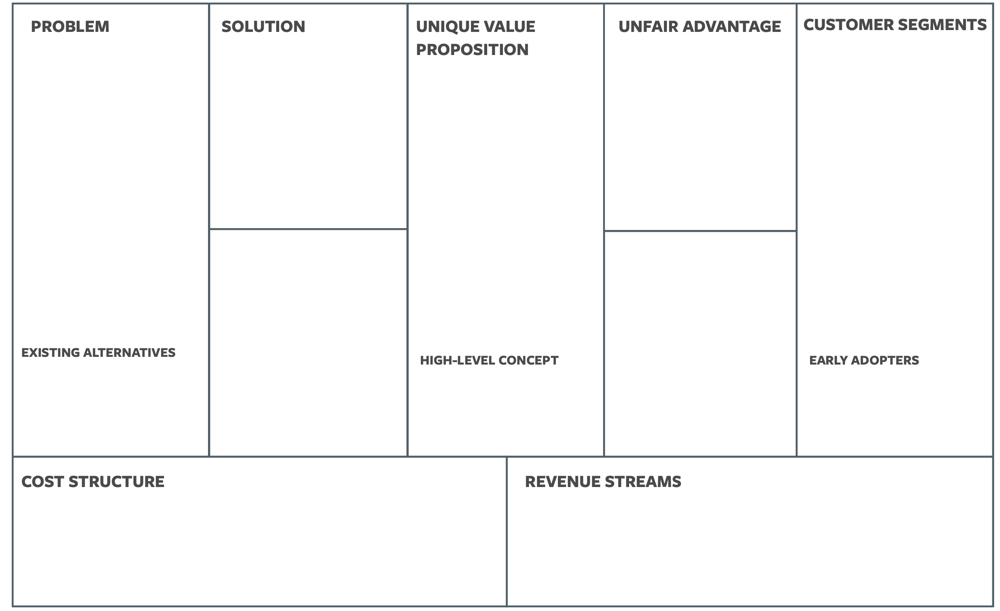

# Business Canvas

The business canvas helps us stay disciplined about documenting and validating our riskiest business model hypotheses. The canvas is a roadmap for validating and developing a business plan. It’s an important tool to help us stay aligned on what a successful business looks like.

The business canvas was developed to help entrepreneurs define new products. It can also be used successfully to summarize how an existing product drives business impact, and where there may be opportunities for optimization.

## Business Canvas Template

## Components of a Business Canvas

- The **problem** is our customers’ top 3 underserved or unaddressed needs.
- The **solution** is the top 3 features we believe will address our customers’ problem.
- **Key metrics** are the key activities we measure. 
- The **unique value proposition** is a clear and concise message that states how we are unique and worth buying/engaging with.
- **Advantage** is something we have that can’t be easily bought or copied.
- **Channels** is our path to our customers. 
- **Customer segments** are our target customers. 
- **Cost structure** and **revenue streams** is how we plan to spend and make money.